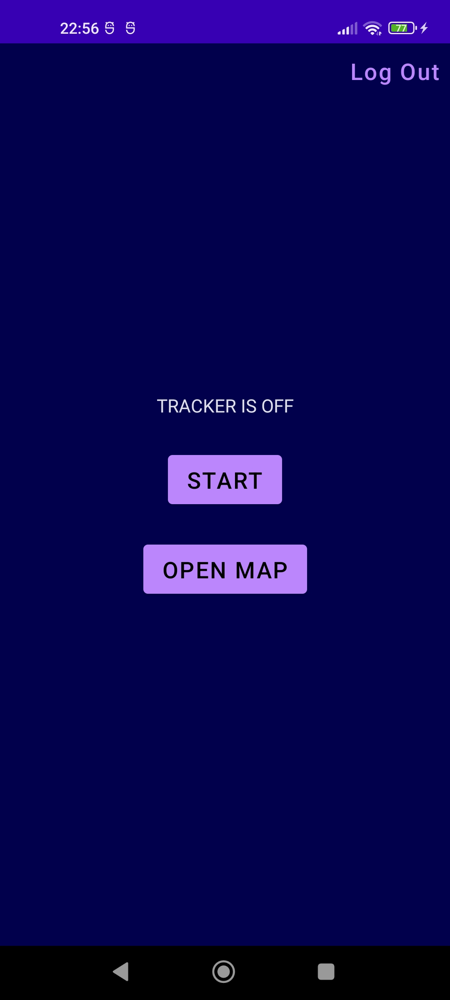
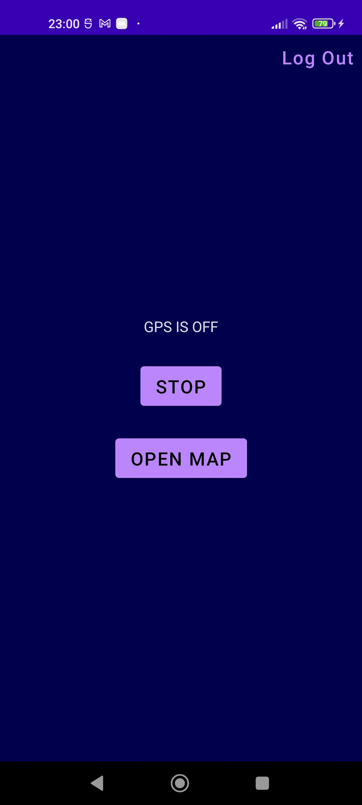
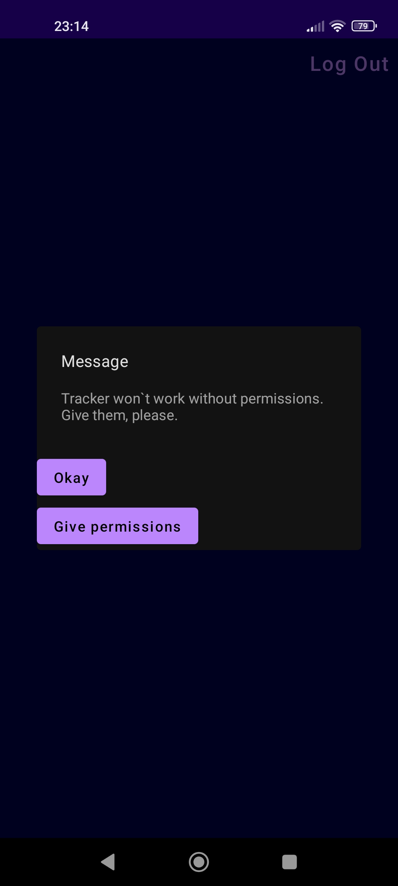
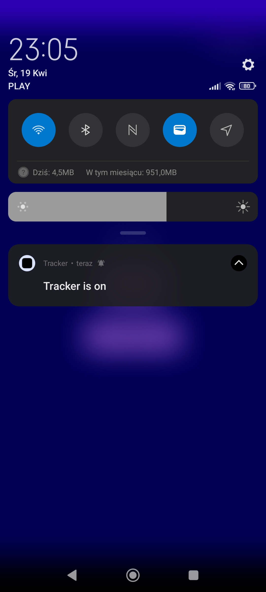
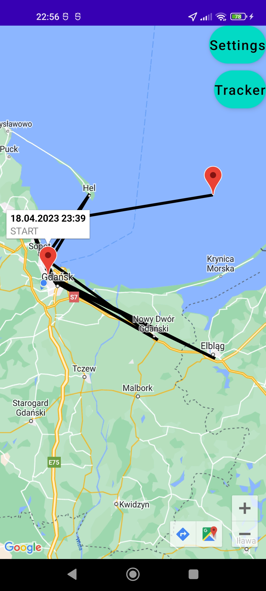
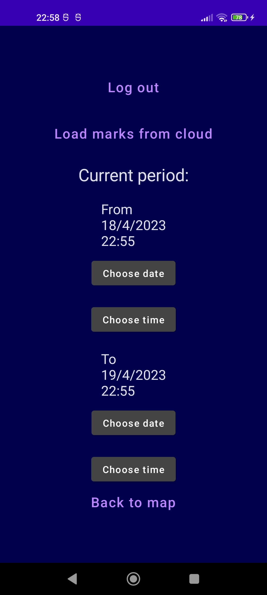
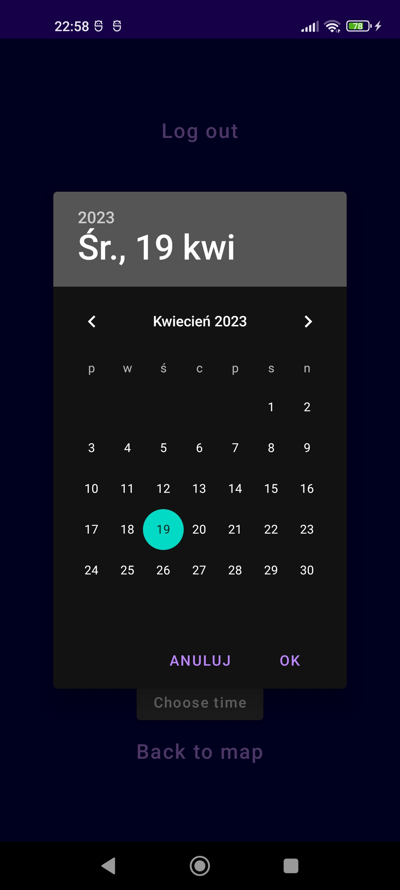
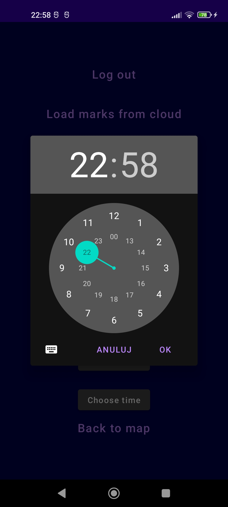
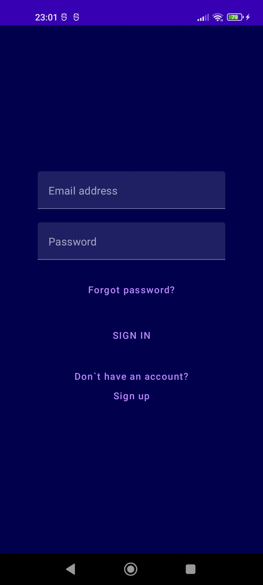
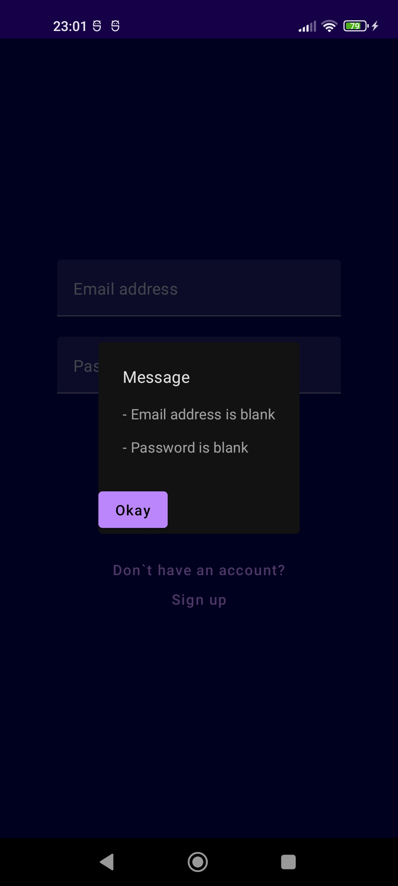

# Tracker
In this Android application you can track locations and send them to firebase/cloud firestore server. 
Also the app can show on the map collected locations of authenticated user.

